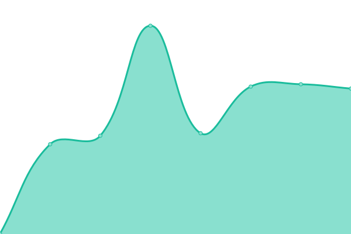

# [📈 Live Status](https://for-memory.github.io/PT-Sites-Observer): <!--live status--> **🟩 All systems operational**

This repository contains the open-source uptime monitor and status page for [WinnieThePooh](https://for-memory.github.io/PT-Sites-Observer), powered by [Upptime](https://github.com/upptime/upptime).

With [Upptime](https://upptime.js.org), you can get your own unlimited and free uptime monitor and status page, powered entirely by a GitHub repository. We use [Issues](https://github.com/for-memory/PT-Sites-Observer/issues) as incident reports, [Actions](https://github.com/for-memory/PT-Sites-Observer/actions) as uptime monitors, and [Pages](https://for-memory.github.io/PT-Sites-Observer) for the status page.

<!--start: status pages-->
<!-- This summary is generated by Upptime (https://github.com/upptime/upptime) -->
<!-- Do not edit this manually, your changes will be overwritten -->
<!-- prettier-ignore -->
| URL | Status | History | Response Time | Uptime |
| --- | ------ | ------- | ------------- | ------ |
|  The most unstable tracker | 🟩 Up | [the-most-unstable-tracker.yml](https://github.com/for-memory/PT-Sites-Observer/commits/master/history/the-most-unstable-tracker.yml) | 

 862ms
     
 | 

<a href="https://for-memory.github.io/PT-Sites-Observer/history/the-most-unstable-tracker">100.00%</a>
    

|  U2 | 🟩 Up | [u2.yml](https://github.com/for-memory/PT-Sites-Observer/commits/master/history/u2.yml) | 

 702ms
     
 | 

<a href="https://for-memory.github.io/PT-Sites-Observer/history/u2">96.21%</a>
    

|  HDC | 🟩 Up | [hdc.yml](https://github.com/for-memory/PT-Sites-Observer/commits/master/history/hdc.yml) | 

 320ms
     
 | 

<a href="https://for-memory.github.io/PT-Sites-Observer/history/hdc">100.00%</a>
    

|  SSD | 🟩 Up | [ssd.yml](https://github.com/for-memory/PT-Sites-Observer/commits/master/history/ssd.yml) | 

 257ms
     
 | 

<a href="https://for-memory.github.io/PT-Sites-Observer/history/ssd">99.07%</a>
    

<!--end: status pages-->

[**Visit our status website →**](https://for-memory.github.io/PT-Sites-Observer)

## 📄 License

- Powered by: [Upptime](https://github.com/upptime/upptime)
- Code: [MIT](./LICENSE) © [WinnieThePooh](https://for-memory.github.io/PT-Sites-Observer)
- Data in the `./history` directory: [Open Database License](https://opendatacommons.org/licenses/odbl/1-0/)
